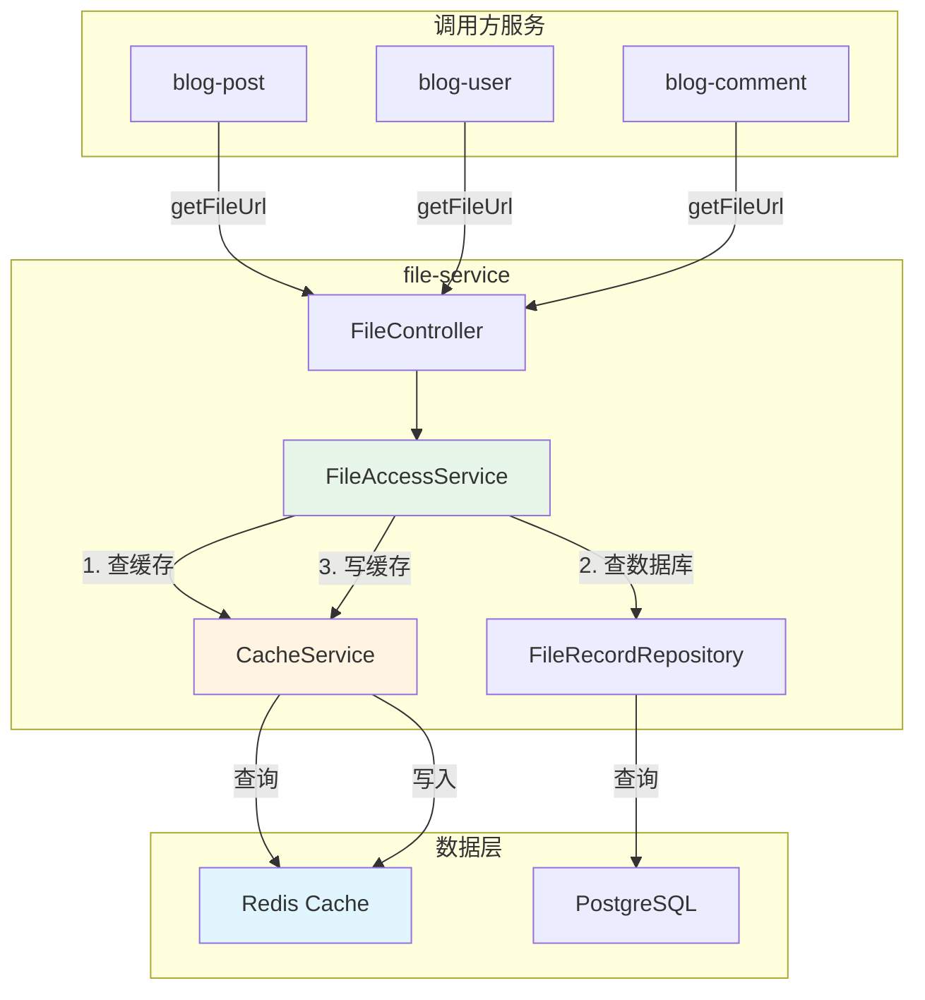

# Design Document

## Overview

本设计文档定义了在 file-service 中实现文件 URL 缓存的技术方案。缓存将在 `FileAccessService.getFileUrl()` 方法中实现，使用 Cache-Aside 模式，对调用方完全透明。

**设计原则**：
- **单一职责**: 缓存逻辑封装在 file-service 内部
- **对外透明**: 调用方无需感知缓存的存在
- **降级友好**: Redis 不可用时自动降级到数据库查询
- **配置驱动**: 所有参数可通过配置文件调整

**核心流程**：
```
调用 getFileUrl(fileId)
    ↓
查询 Redis 缓存
    ↓
缓存命中? → 是 → 返回缓存的 URL
    ↓ 否
查询数据库
    ↓
写入 Redis 缓存（TTL: 1小时）
    ↓
返回 URL
```

## Architecture

### 系统架构图



### 缓存策略：Cache-Aside

**读取流程**：
1. 应用程序查询缓存
2. 缓存命中 → 返回数据
3. 缓存未命中 → 查询数据库 → 写入缓存 → 返回数据

**写入流程**（文件删除）**：
1. 应用程序删除数据库记录
2. 应用程序删除缓存

**优势**：
- 实现简单，逻辑清晰
- 缓存失效策略灵活
- 适合读多写少的场景

## Components

### 1. FileRedisKeys 类

**职责**: 管理所有文件相关的 Redis Key

**位置**: `com.architectcgz.file.infrastructure.cache.FileRedisKeys`

```java
package com.architectcgz.file.infrastructure.cache;

/**
 * 文件服务 Redis Key 管理类
 * 
 * 统一管理所有文件相关的缓存 Key，避免硬编码
 */
public class FileRedisKeys {
    
    private static final String PREFIX = "file";
    
    /**
     * 文件 URL 缓存 Key
     * 格式: file:{fileId}:url
     * 
     * @param fileId 文件ID
     * @return Redis Key
     */
    public static String fileUrl(String fileId) {
        return PREFIX + ":" + fileId + ":url";
    }
}
```

### 2. CacheProperties 配置类

**职责**: 管理缓存相关配置参数

**位置**: `com.architectcgz.file.infrastructure.config.CacheProperties`


```java
package com.architectcgz.file.infrastructure.config;

import lombok.Data;
import org.springframework.boot.context.properties.ConfigurationProperties;
import org.springframework.stereotype.Component;

/**
 * 缓存配置属性
 */
@Data
@Component
@ConfigurationProperties(prefix = "file-service.cache")
public class CacheProperties {
    
    /**
     * 是否启用缓存
     */
    private boolean enabled = true;
    
    /**
     * URL 缓存配置
     */
    private UrlCache url = new UrlCache();
    
    @Data
    public static class UrlCache {
        /**
         * 缓存过期时间（秒）
         */
        private long ttl = 3600; // 1小时
    }
}
```

### 3. FileAccessService 修改

**职责**: 在 getFileUrl 方法中集成缓存逻辑

**修改点**：
- 注入 RedisTemplate 和 CacheProperties
- 在查询前先查缓存
- 在查询后写入缓存
- 实现降级逻辑

**伪代码**：
```java
public FileUrlResponse getFileUrl(String appId, String fileId, String requestUserId) {
    // 1. 尝试从缓存获取
    if (cacheProperties.isEnabled()) {
        String cachedUrl = getCachedUrl(fileId);
        if (cachedUrl != null) {
            return buildResponse(cachedUrl, true);
        }
    }
    
    // 2. 缓存未命中，查询数据库
    FileRecord file = fileRecordRepository.findById(fileId)
            .orElseThrow(() -> new BusinessException("文件不存在: " + fileId));
    
    // 验证权限...
    String url = generateUrl(file);
    
    // 3. 写入缓存
    if (cacheProperties.isEnabled()) {
        cacheUrl(fileId, url);
    }
    
    return buildResponse(url, false);
}
```

### 4. FileManagementService 修改

**职责**: 在文件删除时清除缓存

**修改点**：
- 注入 RedisTemplate
- 在删除文件后清除缓存

**伪代码**：
```java
public void deleteFile(String appId, String fileId, String requestUserId) {
    // 1. 删除文件记录
    fileRecordRepository.deleteById(fileId);
    
    // 2. 删除存储的文件
    storageService.deleteFile(storagePath);
    
    // 3. 清除缓存
    if (cacheProperties.isEnabled()) {
        clearCache(fileId);
    }
}
```

## Data Models

### Redis 数据结构

**Key 格式**: `file:{fileId}:url`

**Value 类型**: String（文件访问 URL）

**TTL**: 3600 秒（1 小时，可配置）

**示例**：
```
Key: file:01JGXXX-XXX-XXX-XXX-XXXXXXXXXXXX:url
Value: https://cdn.example.com/blog/2026/01/21/12345/images/xxx.webp
TTL: 3600
```

### 配置文件

**application.yml**：
```yaml
# Redis 配置
spring:
  data:
    redis:
      host: ${REDIS_HOST:localhost}
      port: ${REDIS_PORT:6379}
      password: ${REDIS_PASSWORD:}
      database: ${REDIS_DATABASE:0}
      timeout: 3000ms
      lettuce:
        pool:
          max-active: 8
          max-idle: 8
          min-idle: 0
          max-wait: -1ms

# 文件服务缓存配置
file-service:
  cache:
    enabled: ${CACHE_ENABLED:true}
    url:
      ttl: ${CACHE_URL_TTL:3600}  # 1小时
```

## Correctness Properties

### Property 1: 缓存一致性

*For any* 文件 URL 查询操作，IF 缓存中存在该 fileId 的 URL，THEN 返回的 URL 必须与数据库中的 URL 一致。

**Validates**: Requirements FR2, FR3

### Property 2: 缓存失效正确性

*For any* 文件删除操作，删除成功后，该 fileId 的缓存必须被清除。

**Validates**: Requirements FR4

### Property 3: 降级可用性

*For any* Redis 不可用的情况，系统必须能够降级到数据库查询，并正常返回文件 URL。

**Validates**: Requirements NFR2

### Property 4: 缓存 Key 唯一性

*For any* 两个不同的 fileId，生成的缓存 Key 必须不同。

**Validates**: Requirements FR5

### Property 5: TTL 正确性

*For any* 写入缓存的 URL，其 TTL 必须等于配置的 `file-service.cache.url.ttl` 值。

**Validates**: Requirements FR3, FR6

## Implementation Details

### 缓存读取实现

```java
/**
 * 从缓存获取文件 URL
 * 
 * @param fileId 文件ID
 * @return 缓存的 URL，如果不存在返回 null
 */
private String getCachedUrl(String fileId) {
    try {
        String cacheKey = FileRedisKeys.fileUrl(fileId);
        String cachedUrl = redisTemplate.opsForValue().get(cacheKey);
        
        if (cachedUrl != null) {
            log.debug("Cache hit: fileId={}", fileId);
            return cachedUrl;
        }
        
        log.debug("Cache miss: fileId={}", fileId);
        return null;
    } catch (Exception e) {
        log.warn("Failed to get cached URL, fallback to database: fileId={}", fileId, e);
        return null;
    }
}
```

### 缓存写入实现

```java
/**
 * 将文件 URL 写入缓存
 * 
 * @param fileId 文件ID
 * @param url 文件访问URL
 */
private void cacheUrl(String fileId, String url) {
    try {
        String cacheKey = FileRedisKeys.fileUrl(fileId);
        long ttl = cacheProperties.getUrl().getTtl();
        
        redisTemplate.opsForValue().set(cacheKey, url, ttl, TimeUnit.SECONDS);
        log.debug("Cached URL: fileId={}, ttl={}s", fileId, ttl);
    } catch (Exception e) {
        log.warn("Failed to cache URL: fileId={}", fileId, e);
        // 缓存失败不影响业务流程
    }
}
```

### 缓存清除实现

```java
/**
 * 清除文件 URL 缓存
 * 
 * @param fileId 文件ID
 */
private void clearCache(String fileId) {
    try {
        String cacheKey = FileRedisKeys.fileUrl(fileId);
        Boolean deleted = redisTemplate.delete(cacheKey);
        
        if (Boolean.TRUE.equals(deleted)) {
            log.info("Cache cleared: fileId={}", fileId);
        } else {
            log.debug("Cache not found: fileId={}", fileId);
        }
    } catch (Exception e) {
        log.warn("Failed to clear cache: fileId={}", fileId, e);
        // 缓存清除失败不影响业务流程
    }
}
```

## Error Handling

### 异常处理策略

| 异常类型 | 处理方式 | 日志级别 | 影响 |
|---------|---------|---------|------|
| Redis 连接失败 | 降级到数据库查询 | WARN | 性能下降，功能正常 |
| 缓存读取失败 | 降级到数据库查询 | WARN | 性能下降，功能正常 |
| 缓存写入失败 | 忽略，继续执行 | WARN | 下次查询慢，功能正常 |
| 缓存删除失败 | 忽略，继续执行 | WARN | 可能返回旧数据，TTL 后自动过期 |

### 降级逻辑

```java
private String getFileUrlWithFallback(String fileId) {
    // 尝试从缓存获取
    try {
        String cachedUrl = getCachedUrl(fileId);
        if (cachedUrl != null) {
            return cachedUrl;
        }
    } catch (Exception e) {
        log.warn("Cache unavailable, fallback to database: fileId={}", fileId, e);
    }
    
    // 降级到数据库查询
    return getFileUrlFromDatabase(fileId);
}
```

## Testing Strategy

### 单元测试

**测试类**: `FileAccessServiceTest`

**测试用例**：
1. 测试缓存命中场景
2. 测试缓存未命中场景
3. 测试缓存写入
4. 测试缓存清除
5. 测试 Redis 不可用时的降级
6. 测试缓存开关配置

**Mock 对象**：
- RedisTemplate
- FileRecordRepository
- StorageService

### 集成测试

**测试类**: `FileCacheIntegrationTest`

**测试用例**：
1. 测试完整的缓存读写流程
2. 测试文件删除后缓存清除
3. 测试 TTL 过期
4. 测试并发访问

**依赖**：
- 真实的 Redis（使用 Testcontainers）
- 真实的 PostgreSQL（使用 Testcontainers）

### 属性测试

使用 jqwik 进行属性测试：

```java
@Property(tries = 100)
@Label("Feature: file-url-caching, Property 1: 缓存一致性")
void property_cacheConsistency(@ForAll("fileIds") String fileId) {
    // 第一次查询（缓存未命中）
    String url1 = fileAccessService.getFileUrl("blog", fileId, "user1").getUrl();
    
    // 第二次查询（缓存命中）
    String url2 = fileAccessService.getFileUrl("blog", fileId, "user1").getUrl();
    
    // 两次查询结果必须一致
    assertEquals(url1, url2);
}
```

## Performance Optimization

### 缓存命中率优化

**目标**: 缓存命中率 > 80%

**策略**：
- 合理设置 TTL（1 小时）
- 热点数据预热（可选）
- 监控缓存命中率

### 响应时间优化

**目标**: 缓存命中时响应时间 < 10ms

**策略**：
- 使用 Lettuce 连接池
- 避免在缓存操作中进行复杂计算
- 异步写入缓存（可选）

### 批量查询优化（未来）

当前不实现，但预留扩展点：

```java
public Map<String, String> getFileUrls(List<String> fileIds) {
    // 1. 批量查询缓存（使用 Pipeline）
    // 2. 对于缓存未命中的 fileId，批量查询数据库
    // 3. 批量写入缓存
}
```

## Monitoring and Logging

### 日志规范

**日志级别**：
- DEBUG: 缓存命中/未命中、缓存写入/删除
- WARN: 缓存操作失败、降级
- INFO: 文件删除后缓存清除
- ERROR: 不应该出现（缓存失败不影响业务）

**日志格式**：
```
[{timestamp}] [{level}] [{class}] Cache {operation}: fileId={fileId}, result={result}
```

**示例**：
```
2026-02-09 10:00:00.123 [DEBUG] [FileAccessService] Cache hit: fileId=01JGXXX
2026-02-09 10:00:01.456 [DEBUG] [FileAccessService] Cache miss: fileId=01JGYYY
2026-02-09 10:00:02.789 [DEBUG] [FileAccessService] Cached URL: fileId=01JGYYY, ttl=3600s
2026-02-09 10:00:03.012 [INFO] [FileManagementService] Cache cleared: fileId=01JGZZZ
2026-02-09 10:00:04.345 [WARN] [FileAccessService] Cache unavailable, fallback to database: fileId=01JGAAA
```

### 监控指标

**Micrometer 指标**：

| 指标名称 | 类型 | 说明 |
|---------|------|------|
| `file.cache.hit` | Counter | 缓存命中次数 |
| `file.cache.miss` | Counter | 缓存未命中次数 |
| `file.cache.write` | Counter | 缓存写入次数 |
| `file.cache.delete` | Counter | 缓存删除次数 |
| `file.cache.error` | Counter | 缓存操作失败次数 |
| `file.cache.query.time` | Timer | 缓存查询耗时 |

**计算指标**：
- 缓存命中率 = hit / (hit + miss)
- 缓存可用率 = (hit + miss) / (hit + miss + error)

### 告警规则

| 指标 | 阈值 | 级别 | 说明 |
|------|------|------|------|
| 缓存命中率 | < 80% | WARNING | 缓存效果不佳 |
| 缓存命中率 | < 50% | CRITICAL | 缓存严重失效 |
| 缓存错误率 | > 10% | WARNING | Redis 可能不稳定 |
| 缓存错误率 | > 50% | CRITICAL | Redis 不可用 |
| 缓存查询耗时 P99 | > 50ms | WARNING | Redis 性能下降 |

## Configuration Examples

### 开发环境配置

```yaml
spring:
  data:
    redis:
      host: localhost
      port: 6379
      password: redis123456

file-service:
  cache:
    enabled: true
    url:
      ttl: 600  # 10分钟（开发环境短一些）
```

### 生产环境配置

```yaml
spring:
  data:
    redis:
      host: ${REDIS_HOST}
      port: ${REDIS_PORT}
      password: ${REDIS_PASSWORD}
      database: 0
      timeout: 3000ms
      lettuce:
        pool:
          max-active: 20
          max-idle: 10
          min-idle: 5
          max-wait: 3000ms

file-service:
  cache:
    enabled: true
    url:
      ttl: 3600  # 1小时
```

### 禁用缓存配置（测试用）

```yaml
file-service:
  cache:
    enabled: false
```

## Migration Plan

### 实施步骤

1. **添加依赖**（5 分钟）
   - 在 pom.xml 中添加 spring-boot-starter-data-redis

2. **创建配置类**（10 分钟）
   - 创建 CacheProperties
   - 创建 FileRedisKeys
   - 配置 RedisTemplate

3. **修改 FileAccessService**（30 分钟）
   - 添加缓存读取逻辑
   - 添加缓存写入逻辑
   - 实现降级逻辑

4. **修改 FileManagementService**（10 分钟）
   - 添加缓存清除逻辑

5. **编写单元测试**（30 分钟）
   - 测试缓存命中/未命中
   - 测试降级逻辑

6. **编写集成测试**（30 分钟）
   - 测试完整流程
   - 测试 TTL 过期

7. **配置监控**（15 分钟）
   - 添加 Micrometer 指标
   - 配置 Grafana 面板

8. **文档更新**（10 分钟）
   - 更新 README
   - 更新 API 文档

**总计**: 约 2.5 小时

### 回滚计划

如果出现问题，可以通过配置快速回滚：

```yaml
file-service:
  cache:
    enabled: false  # 禁用缓存，恢复到原始行为
```

## Related Documents

- [需求文档](./requirements.md)
- [缓存架构决策文档](../file-service-fileid-migration/caching-architecture.md)
- [缓存规范](../../../blog-microservice/.kiro/steering/common/16-cache.md)
- [常量管理规范](../../../blog-microservice/.kiro/steering/common/03-constants-config.md)

---

**文档版本**: 1.0  
**创建日期**: 2026-02-09  
**最后更新**: 2026-02-09  
**作者**: 开发团队
